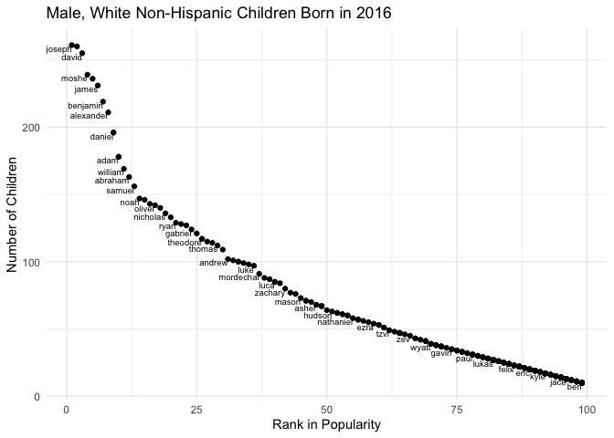

HW3
================
Stephen Powers
9/26/2019

## Problem 1

``` r
library(readxl)
library(tidyverse)
```

    ## ── Attaching packages ───────────────────────────────────────────────────── tidyverse 1.2.1 ──

    ## ✔ ggplot2 3.2.1     ✔ purrr   0.3.2
    ## ✔ tibble  2.1.3     ✔ dplyr   0.8.3
    ## ✔ tidyr   1.0.0     ✔ stringr 1.4.0
    ## ✔ readr   1.3.1     ✔ forcats 0.4.0

    ## ── Conflicts ──────────────────────────────────────────────────────── tidyverse_conflicts() ──
    ## ✖ dplyr::filter() masks stats::filter()
    ## ✖ dplyr::lag()    masks stats::lag()

### Importing and Cleaning Data

### *TrashWheel Data*

``` r
TrashWheel = 
  read_excel("./data/HealthyHarborWaterWheelTotals2018-7-28.xlsx",
                        sheet = 1) %>%
  janitor::clean_names() %>%
  drop_na (dumpster) %>%
  mutate(sports_balls = as.integer(sports_balls))
```

    ## New names:
    ## * `` -> ...15
    ## * `` -> ...16
    ## * `` -> ...17

### *2017 Precipitation Data*

``` r
Precipitation_2017 =
  read_excel("./data/HealthyHarborWaterWheelTotals2018-7-28.xlsx",
                        sheet = "2017 Precipitation", skip = 1) %>%
  janitor::clean_names() %>%
  drop_na(total) %>%
  mutate(year = "2017")
```

### *2018 Precipitation Data*

``` r
Precipitation_2018 = 
  read_excel("./data/HealthyHarborWaterWheelTotals2018-7-28.xlsx",
                        sheet = "2018 Precipitation", skip = 1) %>%
  janitor::clean_names() %>%
  drop_na(total) %>%
  mutate(year = "2018")
```

### *Combining Precipitation Data*

``` r
Precipitation_2017_2018 = 
  bind_rows(Precipitation_2017, Precipitation_2018) %>%
  mutate(month = month.name[month]) %>%
  select(year, month, total)
```

#### TrashWheel and Precipitation Data Description

There are 344 observations in the Mr. Trash Wheel dataset, and there
here are 26 observations in the combined precipitation dataset. Key
variables in the Mr. Trash Wheel data set includes the following:
dumpster, month, year, date, weight\_tons, volume\_cubic\_yards,
plastic\_bottles, polystyrene, cigarette\_butts, glass\_bottles,
grocery\_bags, chip\_bags, sports\_balls, homes\_powered, x15, x16, x17.
Key variables in the combined precipitation data set includes the
following: year, month, total. The total precipitation in 2018 was
140.66. The median number of sports balls in a dumpster in 2017 was 8.

## Problem 2

### *Pols-Month Data*

``` r
pols =
  read_csv("./data/pols-month.csv") %>%
  separate(mon, c("year", "month", "day")) %>%
  mutate(
    year = as.numeric(year),
    month = as.numeric(month),
    month = month.name[month],
    president = 
      ifelse((prez_gop == 1 & prez_dem == 0), "gop",
                       ifelse((prez_dem == 1 & prez_gop == 0), "dem", NA))) %>%
    select(-prez_gop, -prez_dem, -day)
```

    ## Parsed with column specification:
    ## cols(
    ##   mon = col_date(format = ""),
    ##   prez_gop = col_double(),
    ##   gov_gop = col_double(),
    ##   sen_gop = col_double(),
    ##   rep_gop = col_double(),
    ##   prez_dem = col_double(),
    ##   gov_dem = col_double(),
    ##   sen_dem = col_double(),
    ##   rep_dem = col_double()
    ## )

#### Pols Data Description

There are 822 observations, and there are 9 columns. The range of the
years is from 1947 to 2015. The dataset contains the following
variables: year, month, gov\_gop, sen\_gop, rep\_gop, gov\_dem,
sen\_dem, rep\_dem, president.

### *SNP Data*

``` r
snp =
  read_csv("./data/snp.csv") %>%
  separate(date, c("month", "day", "year")) %>%
  mutate(
    year = as.numeric(year),
    monthnumber = as.numeric(month),
    month = month.name[monthnumber]) %>%
  arrange(year, monthnumber) %>%
  select(year, month, close, -day, -monthnumber)
```

    ## Parsed with column specification:
    ## cols(
    ##   date = col_character(),
    ##   close = col_double()
    ## )

#### SNP Data Description

There are 787 observations, and there are 3 columns. The range of the
years is from 1950 to 2015. The dataset contains the following
variables: year, month, close.

### *Unemployment Data*

``` r
unemployment = read_csv("./data/unemployment.csv") %>%
  pivot_longer(Jan:Dec,
    names_to = "month",
    values_to = "rate") %>%
  janitor::clean_names() %>%
  mutate(month = month.name[match(month, month.abb)])
```

    ## Parsed with column specification:
    ## cols(
    ##   Year = col_double(),
    ##   Jan = col_double(),
    ##   Feb = col_double(),
    ##   Mar = col_double(),
    ##   Apr = col_double(),
    ##   May = col_double(),
    ##   Jun = col_double(),
    ##   Jul = col_double(),
    ##   Aug = col_double(),
    ##   Sep = col_double(),
    ##   Oct = col_double(),
    ##   Nov = col_double(),
    ##   Dec = col_double()
    ## )

#### Unemployment Data Description

There are 816 observations, and there are 3 columns. The range of the
years is from 1948 to 2015. The dataset contains the following
variables: year, month, rate.

### *Merging Pols, SNP, and Unemployment Data*

``` r
pols_snp_unemp = pols %>%
  left_join(snp, by = c("year", "month")) %>%
  left_join(unemployment, by = c("year", "month"))
```

#### Pols, SNP, and Unemployment Data Description

There are 822 observations, and there are 11 columns. The range of the
years is from 1947 to 2015. The dataset contains the following
variables: year, month, gov\_gop, sen\_gop, rep\_gop, gov\_dem,
sen\_dem, rep\_dem, president, close, rate.

## Problem 3

### *Popular Baby Names Data*

``` r
popular_baby_names = read_csv("./data/Popular_Baby_Names.csv") %>% 
  janitor::clean_names() %>% 
  mutate(ethnicity = recode(ethnicity, "WHITE NON HISP" = "WHITE NON HISPANIC",
                            "BLACK NON HISP" = "BLACK NON HISPANIC",
                            "ASIAN AND PACI" = "ASIAN AND PACIFIC ISLANDER")) %>% 
  mutate(childs_first_name = str_to_lower(childs_first_name),
         ethnicity = str_to_lower(ethnicity),
         gender = str_to_lower(gender)) %>% 
  distinct()
```

    ## Parsed with column specification:
    ## cols(
    ##   `Year of Birth` = col_double(),
    ##   Gender = col_character(),
    ##   Ethnicity = col_character(),
    ##   `Child's First Name` = col_character(),
    ##   Count = col_double(),
    ##   Rank = col_double()
    ## )

### *Popularity of Name “Olivia” Table*

``` r
popular_baby_names %>% 
  filter(childs_first_name == "olivia") %>% 
  select(-count) %>% 
  pivot_wider(
    names_from = "year_of_birth",
    values_from = "rank") %>%
knitr::kable()
```

| gender | ethnicity                  | childs\_first\_name | 2016 | 2015 | 2014 | 2013 | 2012 | 2011 |
| :----- | :------------------------- | :------------------ | ---: | ---: | ---: | ---: | ---: | ---: |
| female | asian and pacific islander | olivia              |    1 |    1 |    1 |    3 |    3 |    4 |
| female | black non hispanic         | olivia              |    8 |    4 |    8 |    6 |    8 |   10 |
| female | hispanic                   | olivia              |   13 |   16 |   16 |   22 |   22 |   18 |
| female | white non hispanic         | olivia              |    1 |    1 |    1 |    1 |    4 |    2 |

The table above shows the rank in popularity of the name “Olivia” as a
female baby name by ethnicity over time (2016 to 2011).

### *Popular Male Name Table*

``` r
popular_baby_names %>% 
  filter(gender == "male", rank == 1) %>%
  select(-count) %>% 
  pivot_wider(
    names_from = "year_of_birth",
    values_from = "childs_first_name") %>%
knitr::kable()
```

| gender | ethnicity                  | rank | 2016   | 2015   | 2014   | 2013   | 2012   | 2011    |
| :----- | :------------------------- | ---: | :----- | :----- | :----- | :----- | :----- | :------ |
| male   | asian and pacific islander |    1 | ethan  | jayden | jayden | jayden | ryan   | ethan   |
| male   | black non hispanic         |    1 | noah   | noah   | ethan  | ethan  | jayden | jayden  |
| male   | hispanic                   |    1 | liam   | liam   | liam   | jayden | jayden | jayden  |
| male   | white non hispanic         |    1 | joseph | david  | joseph | david  | joseph | michael |

The table above shows the most popular name among male children by
ethnicity over time (2016 to 2011).

### *Scatter Plot for Male, White Non-Hispanic Children Born in 2016*

``` r
popular_baby_names %>% 
  filter(
    gender == "male",
    ethnicity == "white non hispanic",
    year_of_birth == 2016) %>% 
  ggplot(aes(x=rank, y= count)) +
  theme_minimal() +
  geom_point () +
  labs(
    title = "Male, White Non-Hispanic Children Born in 2016",
    x = "Rank in Popularity",
    y = "Number of Children"
  ) +
  geom_text(aes(label = childs_first_name),
            hjust = 1,
            vjust = 1,
            check_overlap = TRUE,
            size = 2.5)
```

<!-- -->
